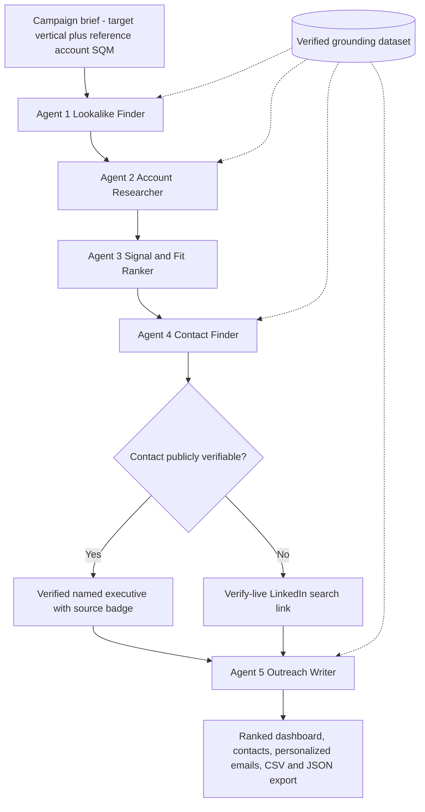

# submission

**Role:** outbound-bdr
**Project:** FlytBase Outbound BDR Engine

## What I built

A single-page web app that turns one campaign brief into a full outbound prospecting package for a BDR. The user edits a brief (target vertical, reference account, goal, FlytBase angle) and clicks **Run Pipeline**. Five specialist agents then run in sequence and stream their output as titled cards: (1) Lookalike Finder, (2) Account Researcher, (3) Signal & Fit Ranker, (4) Contact Finder, (5) Outreach Writer. The result is a ranked account list, real named contacts (with verify-live LinkedIn X-ray links where no public name exists), and personalized cold emails — each copy-to-clipboard. Any stage can be regenerated independently. All company facts, signals, and names come only from an embedded verified grounding dataset, so the system never invents companies, statistics, or people.

## Architecture / Flow

Notes on the flow:

- Five specialist agents run in sequence, each a separate step.
- All company facts, signals, and names come only from a verified grounding dataset embedded in the app.
- The pipeline fans out: one brief becomes many accounts, each account many contacts, each contact its own email; per-account research is done once and reused.
- Stage 4 decision point: if a contact is publicly verifiable, show the named executive with a source badge; otherwise emit a verify-live LinkedIn search link.
- Stage 4 is deterministic (code, no AI call) for reliability; the other stages use the Lovable AI gateway with Google Gemini Flash.

## Why this solves the brief

The brief asks for a visible, delegated agent pipeline that turns one campaign into a ranked, contactable, personalized outbound package without hallucinating. This app makes the delegation literal — five distinct agents, five titled cards, each independently re-runnable — and enforces the anti-hallucination rule at the source by chaining every AI call to a single embedded grounding dataset and by rendering Stage 4 deterministically from that dataset instead of asking a model to produce names. Stage 5 leads with a real FlytBase proof point relevant to Latin American mining (SQM 678 km² autonomous inspection with Adentu, with Anglo American as the secondary peer), so the emails read like a rep did the homework rather than merge-field spam.

## Evidence from the codebase

- `src/lib/pipeline.ts` — the whole pipeline in one inspectable file:
  - `GROUNDING` and `ANTI_HALLUCINATION` constants define the only permitted source of truth for facts, signals, and names.
  - `runStage1` — Lookalike Finder (AI call, ICP + 5–6 accounts from grounding).
  - `runStage2` — Account Researcher (AI call, 3–4 bullet brief per account).
  - `runStage3` — Signal & Fit Ranker (AI call, 0–100 fit score + why-now trigger).
  - `VERIFIED_CONTACTS` map + `runStage4` — deterministic Contact Finder: injects verified named executives (Codelco, SQM, Antofagasta, Sigma Lithium, Vale) with a public-source badge and appends the three target personas as verify-live LinkedIn X-ray search URLs. No AI call, so it can't hang or hallucinate.
  - `runStage5` — Outreach Writer (AI call, one ≤120-word email per contact, persona-differentiated angles, lead credibility line = SQM 678 km² / Adentu, secondary peer = Anglo American).
- `src/routes/api/stage.ts` — server route that proxies each stage call to the Lovable AI gateway using `google/gemini-3.6-flash`, so every agent call is a separate, inspectable request.
- `src/routes/index.tsx` — UI: campaign-brief input, live per-stage progress ("Agent N running…"), five `StageCard`s rendered in order, per-stage **Regenerate** buttons, verified-contact grouping with the `verified · public source` badge, `verify-live` persona rows, and copy-to-clipboard email cards.
- `src/routes/__root.tsx` + `src/styles.css` — FlytBase brand system (charcoal #1A1A1A, Signal Orange #EC7D42, verified green #3A7A65, Lora + Geist + Geist Mono, sharp corners, 8px grid, ~1200px max width).

## Demo / results

The 5-stage pipeline runs live end to end on the deployed app.

- **Accounts identified (Stage 1, ICP-matched to reference account SQM):** Codelco, SQM, Antofagasta Minerals, Albemarle, Sigma Lithium, Vale Base Metals — all real Latin American Li/Cu/Fe-ore operators drawn from the grounding dataset.
- **Ranking (Stage 3):** Top account is **Codelco**, driven by its public "Zero Exposure Mine" strategy plus NTT DATA and Microsoft AI alliances. Observed fit scores include **Vale 86, Albemarle 83, Sigma Lithium 80**.
- **Contacts (Stage 4):** Verified named executives with a public-source badge where available:
  - Codelco — Jorge Gómez (CEO, former VP Operations); Lindor Quiroga (Acting VP Operations)
  - Antofagasta Minerals — Octavio Araneda (COO)
  - Sigma Lithium — Ana Cabral (CEO); Brian Talbot (COO)
  - Vale Base Metals — Shaun Usmar (CEO)
  Where no public name exists, the system emits a verify-live LinkedIn X-ray search link plus the three target personas: Head of Operations, VP of HSE, Site / Division Director.
- **Emails (Stage 5):** One personalized cold email per contact, tied to that company's real signal, referencing FlytBase's real proof points (SQM 678 km² autonomous-inspection deployment with Adentu; Anglo American as secondary peer). Example subject line: *"Operationalizing Zero Exposure at El Teniente"*. Each email is copy-to-clipboard.

## Notes and limitations

- Research and contacts are grounded on a curated verified dataset, not a live web crawl — accurate but not real-time. Next step: a live enrichment API (Apollo or Clay) and a source citation on every signal.
- Stage 4 is deterministic by design to guarantee reliability and zero fabrication; it trades AI flexibility for a hard no-hallucination guarantee on people.
- Stages 1, 2, 3, 5 depend on the Lovable AI gateway (Google Gemini Flash); transient gateway errors surface in the stage card and can be recovered with the per-stage Regenerate button without rerunning the whole pipeline.
